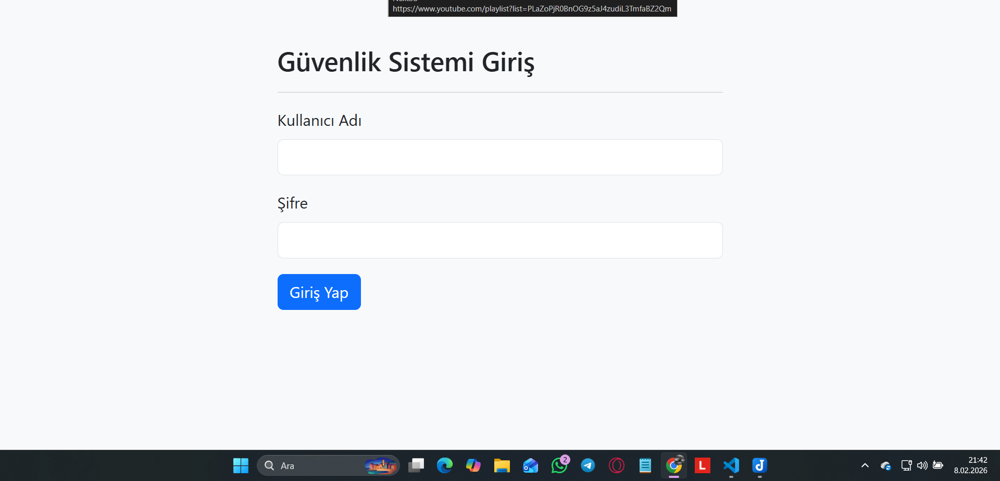
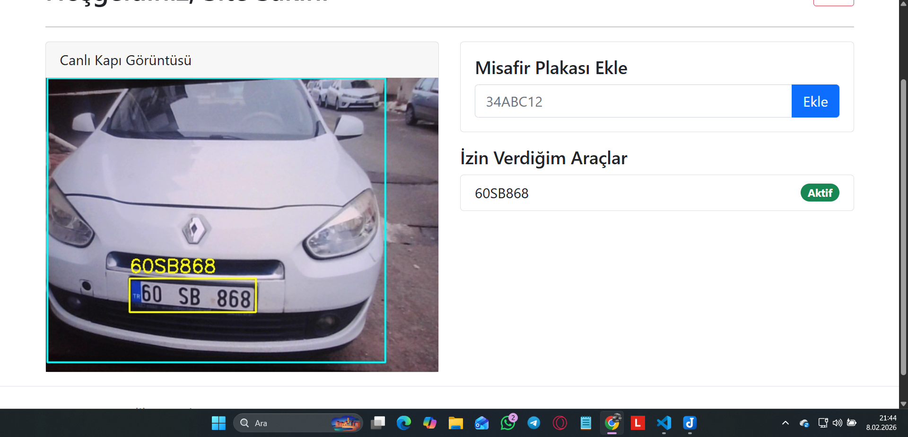
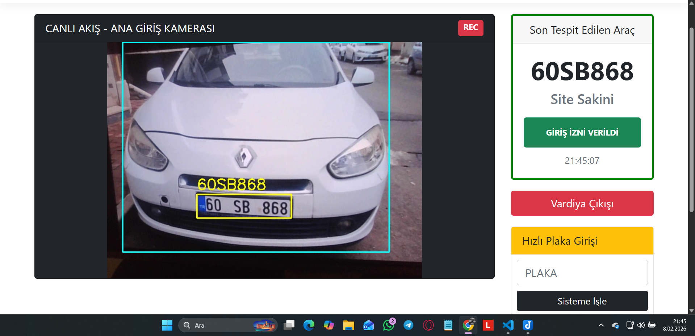
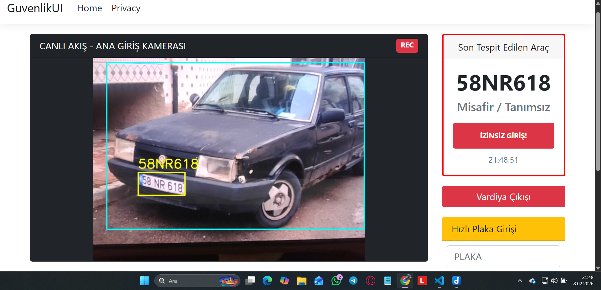
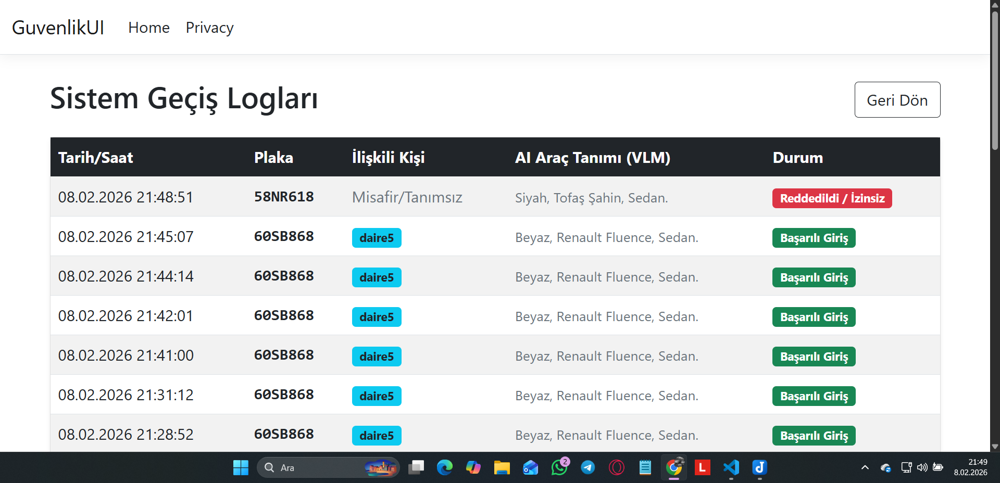

# Yapay Zeka Destekli Akıllı Güvenlik Sistemi

Bu proje, site ve tesis girişlerinde güvenliği sağlamak amacıyla geliştirilmiş, görüntü işleme ve üretken yapay zeka (Generative AI) teknolojilerini birleştiren hibrit bir güvenlik yazılımıdır.

Sıradan plaka okuma sistemlerinden farklı olarak, bu sistem sadece plakayı okumaz; aracın **rengini, modelini ve tipini de görerek** veritabanına kaydeder.

## 3 Katmanlı AI Mimarisi

Sistem, insan gözü ve beyninin çalışma prensibini taklit eden 3 aşamalı bir huni mantığıyla çalışır. Bu sayede hem yüksek performans sağlar hem de işlemciyi yormaz.

### 1️. Katman: Araç Algılama
* **Model:** YOLO26m
* **Görev:** Kameradan gelen tüm görüntüyü tarar. Yaya, ağaç veya trafik işaretlerini görmezden gelerek sadece **araçlara** odaklanır.
* **Sonuç:** Aracı bulur ve görüntüyü sadece o aracı içerecek şekilde kırpar.

Alt katmandaki YOLO ve VLM modellerine sadece burada kırpılan araç görüntüsü gider. Dolayısıyla bu modelin başarısı sistemin başarısınını doğrudan etkileyebileceği için medium (yolo26m) modelini tercih ettim.

### 2️. Katman: Plaka Tespiti ve Araç Tanımlama
Kırpılan araç görüntüsü iki farklı yapay zekaya aynı anda gönderilir:

* **2.1) Plaka Konumu (YOLO26s):** Aracın üzerindeki plakayı tespit der ve sadece plakayı içerecek şekilde kırpar ve 3. katmandaki OCR modeline gönderir.
* **2.2) Görsel Tanımlama (Google Gemini 2.5 VLM):** Krıplan araç görüntüsü buluta (Google Cloud) gönderilir. Yapay zeka araca bakar ve "Beyaz, Sedan, Toyota Corolla" gibi insan benzeri bir yorum yapar.

### 3️. Katman: Plaka Okuma 
* **Model:** EasyOCR / RapidOCR (ai.py dosyasında kullanıcı tercihine göre seçilir. RapidOCR gpuyu çok yorduğu için 2 seçenek koymayı uygun gördüm.)
* **Görev:** Bulunan plaka koordinatındaki pikselleri yazıya (String) çevirir.  
--- 
## Optimizasyon ve Algoritmalar

### 1) Kare Atlama ```if self.frame_count % 10 == 0:```

Saniyede yaklaşık 20-30 kare gelirken her karede plaka okumaya çalışmak gereksiz işlem yüküne sebep olur. Bunun yerine her 10 karede bir okuma yaparak (FPS'e göre değişir saniyede yaklaşık 2-3 okuma) performansı artırdım.
### 2) Çoğunluk Oylama ```Counter(self.plate_history).most_common(1)```
OCR modeli anlık yanlış okumalar yapabilir ama çoğunlukla doğru okur. Anlık yanlış okumaların hataya yol açmaması için son 20 okumayı bir havuzda toplarız. Bu havuzda matematiksel olarak en çok tekrar eden (mod) sonucu "gerçek plaka" olarak kabul ederiz. Örneğin OCR bir karede "34 ABC 12"yi yanlışlıkla "34 OBC 12" okusa da diğer 19 doğru okuma bu hatayı ezer.

### 3) Hafıza Temizliği ```if time.time() - self.last_read_time > 3.0:```
Sistem 3 saniye boyunca geçerli bir plaka göremezse araç gitmiş veya kadrajdan çıkmış demektir. hafızadaki laka verilerini temizleriz. Böylece yeni gelen bir aracın plakası, bir önceki aracın harfleriyle karışmaz. 
### 4) Şüpha Sayacı ```self.mismatch_count >= 3```
Bir plaka okunduktan sonra yeni gelen bir aracın plakası okunurken önceki aracın plakası havuzda çok yer kapladığından yeni plakayı ezebilir. Bu yüzden, baskın plakadan farklı bir plaka okunduğu an bir "şüphe sayacı" başlatılır. Eğer arka arkaya 3 kez baskın plakadan farklı bir plaka okunursa araç değişmiş demektir, bu durumda havuz sıfırlanır ve yeni aracın plakası okunmaya başlar.

---
## Kullanılan Teknolojiler
* **Python 3.12:** Tüm yapay zeka ve backend işlemleri
* **YOLO26:** Araç ve plaka tespitleri
* **OpenCV:** Görüntü kırpma, işleme ve kare çizme işlemleri
* **Google Gemini 2.5 Flash:** Aracı görüp rengini, modelini ve tipini (Sedan, SUV vb.) tanımlama
* **ASP.NET:** Kullanıcıların sisteme eriştiği web arayüzü
* **SQLite & SQLAlchemy:** Gelen giden araçların kaydını ve kullanıcı bilgilerini tutmak için hafif bir veritabanı kullandım.
* **FastAPI:** Python ile C# tarafının birbiriyle iletişimini sağlayan köprü

## Kurulum ve Çalıştırma

Projeyi bilgisayarınızda test etmek için:
**1. Kütüphaneleri Yükleyin ve Ağırlıkları .engine Formatına Dönüştürün** (Bu adım 5-10 dakika sürebilir. Ağırlıklar .pt formatından kullandığınız nvidia karta özel .engine formatına dönüştürülür ve modellerin ekran kartında çalışma performansı artar.)
```bash
cd Python Backend
pip install -r requirements.txt
python export_models.py
```
**2. Python Tarafını Başlatın**
```bash
python app.py
```
**3. C# (Arayüz) Tarafını Başlatın:**
```bash
cd ..
cd GuvenlikUI
dotnet run
```
**Tarayıcıdan terminalde gösterilen adrese gidin:** (Muhtemelen https://localhost:5154)**

## Kullanıcı Rolleri
Sistemde 3 farklı kullanıcı rolü bulunur:
* **Site Sakini:** Kendi misafir araçlarının plakalarını sisteme ekleyebilir. Diğer site sakinlerinin eklediği plakaları göremez.
* **Güvenlik Görevlisi:** Canlı kamerayı izler, kapıya gelen aracın geçiş izni olup olmadığını sistemden görebilir. Güvenlik görevlisinin de sisteme izinli plaka ekleme yetkisi vardır.
* **Admin:** Tüm geçmişi, araç tanımlarını ve logları görebilir.

## Ekran Görüntüleri

* **Giriş Ekranı:**
  

* **Site Sakini Paneli:**
  

* **Güvenlik Görevlisi Paneli:**
  
  

* **Admin Paneli:**
  

**Bu proje, Bilgisayar Mühendisliği Görsel Dil Modelleri dersi kapsamında bir öğrenci projesi olarak geliştirilmiştir.**
